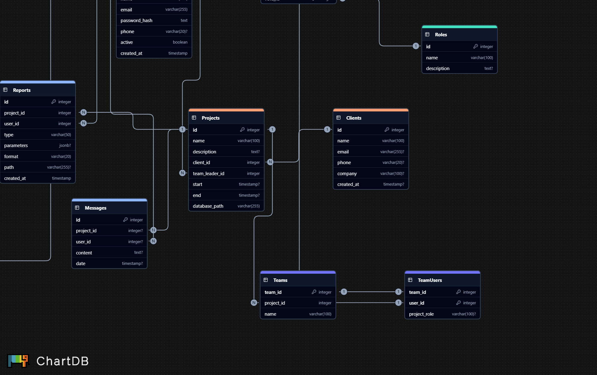

# Despliegue

Esta guía explica cómo levantar una instancia de PostgreSQL usando Docker y ejecutar la inicialización básica del esquema.

## Diagrama de la base de datos



## Requisitos

Necesitas tener instalado:

* Docker
* Docker Compose

## Estructura del Proyecto

```
postgreSQL/
├── .env
├── docker-compose.yml
├── Diagram.png
├── db-data/        (se genera automáticamente)
└── init/
    └── init.sql
```

## Configuración

En `postgreSQL/.env` define credenciales y valores básicos. Cambia los valores por algo seguro:

```ini
POSTGRES_USER=replaceme
POSTGRES_PASSWORD=replaceme
POSTGRES_DB=PMaster

PGADMIN_DEFAULT_EMAIL=admin@example.com
PGADMIN_DEFAULT_PASSWORD=replaceme
```

Docker Compose usa estas variables al iniciar los contenedores.

En el archivo `init/init.sql` modifica las credenciales de conexión de la base de datos

```sql
DO $$
BEGIN
    IF NOT EXISTS (SELECT 1 FROM pg_roles WHERE rolname = 'changeme') THEN
        PERFORM format('CREATE ROLE %I LOGIN PASSWORD %L', 'changeme', 'changeme_p');
    END IF;
END
$$;
GRANT USAGE ON SCHEMA public TO changeme;
GRANT CREATE ON SCHEMA public TO changeme;

ALTER DEFAULT PRIVILEGES IN SCHEMA public GRANT ALL ON TABLES TO changeme;
```

Inicio del Servicio

En el directorio `postgreSQL`, ejecuta:

```bash
docker-compose up -d
```

Esto levanta:

* `db`: PostgreSQL 15
* `pgadmin`: interfaz web para administración

El directorio `init/` se monta en el contenedor y ejecuta automáticamente los scripts `.sql` en el primer arranque.

### Qué hace `init.sql`

1. Crea el rol `changeme` si no existe.
2. Asigna permisos básicos en el esquema `public`.
3. Crea las tablas:

   * `users`
   * `projects`
   * `reports`
   * `notifications`

## Conexión a la Base de Datos

Puedes conectarte con:

* Host: `127.0.0.1`
* Puerto: `5432`
* Base: valor de `POSTGRES_DB`
* Usuario admin: `POSTGRES_USER`
* Contraseña admin: `POSTGRES_PASSWORD`
* Usuario de aplicación: `cilantro` / `cilantro`

## Acceso a PgAdmin

1. Inicia los contenedores (`docker-compose up -d`).
2. Abre `http://localhost:5050`.
3. Ingresa con:

   * Email: `PGADMIN_DEFAULT_EMAIL`
   * Password: `PGADMIN_DEFAULT_PASSWORD`

### Datos para el registro del servidor

En PgAdmin:

* General → Nombre: como quieras
* Connection:

  * Host: `db`
  * Port: `5432`
  * Maintenance DB: `PMaster`
  * Username: `changeme`
  * Password: `changeme_p`

> El host es `db` porque PgAdmin y PostgreSQL corren en la misma red interna de Docker.

## Persistencia

La información se guarda bajo `./db-data`, que está mapeado al volumen de PostgreSQL.
Los datos persisten aunque reinicies o detengas los contenedores.

## Apagar Servicios

```bash
docker-compose down
```

## Destruir la base de datos

1. Detén contenedores:

   ```bash
   docker-compose down
   ```
2. Elimina `./db-data` (carpeta local).
3. Levanta nuevamente:

   ```bash
   docker-compose up -d
   ```
