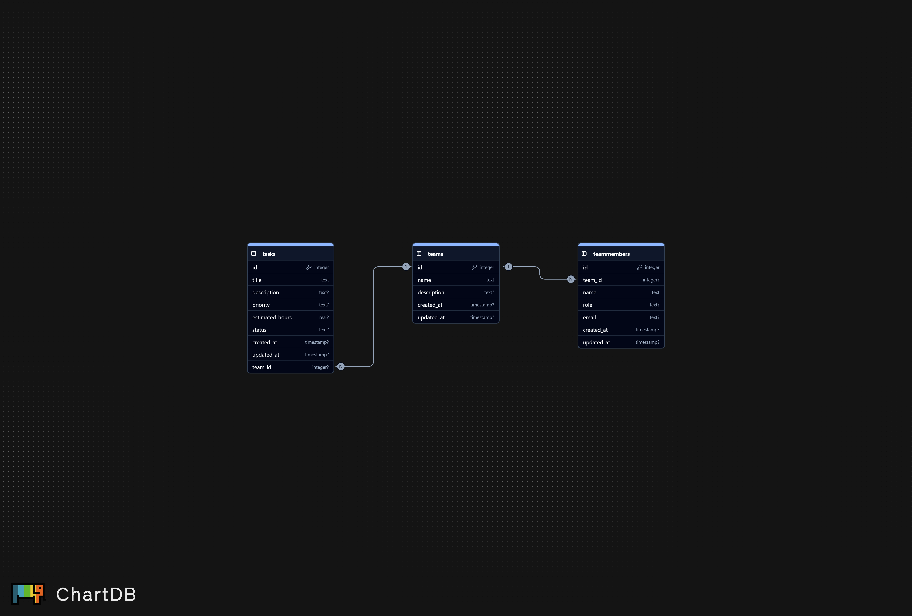

# Infraesturctura de las bases de datos para el Sistema de Gestión de Proyectos para el Centro de Desarrollo UAQ

## Estructura del repositorio

- postgreSQL folder: Base de datos central

- SQLite: Base de datos por proyecto

